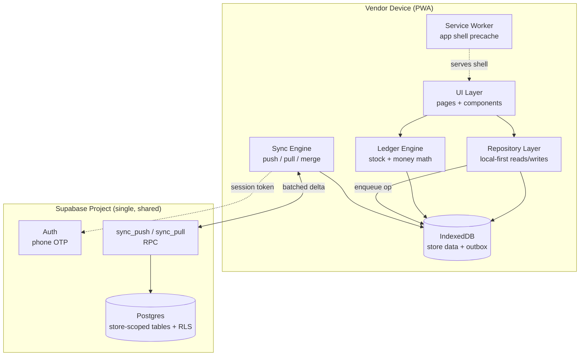
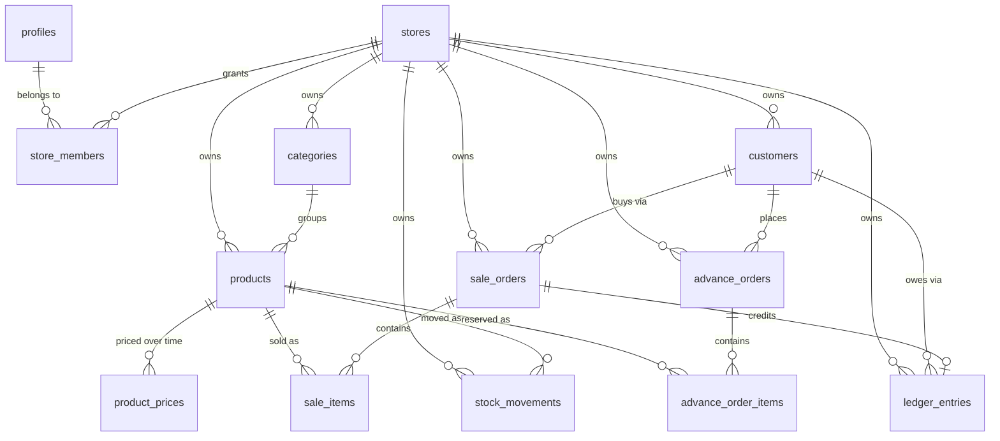
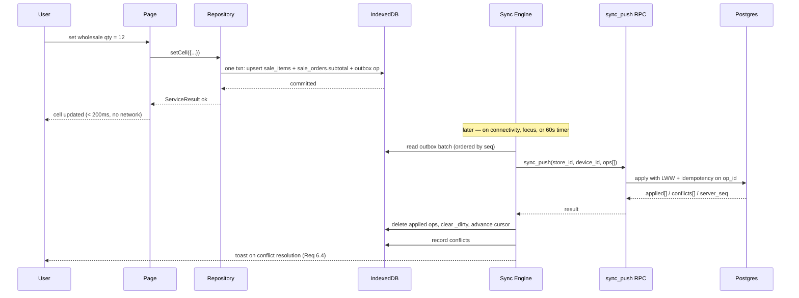
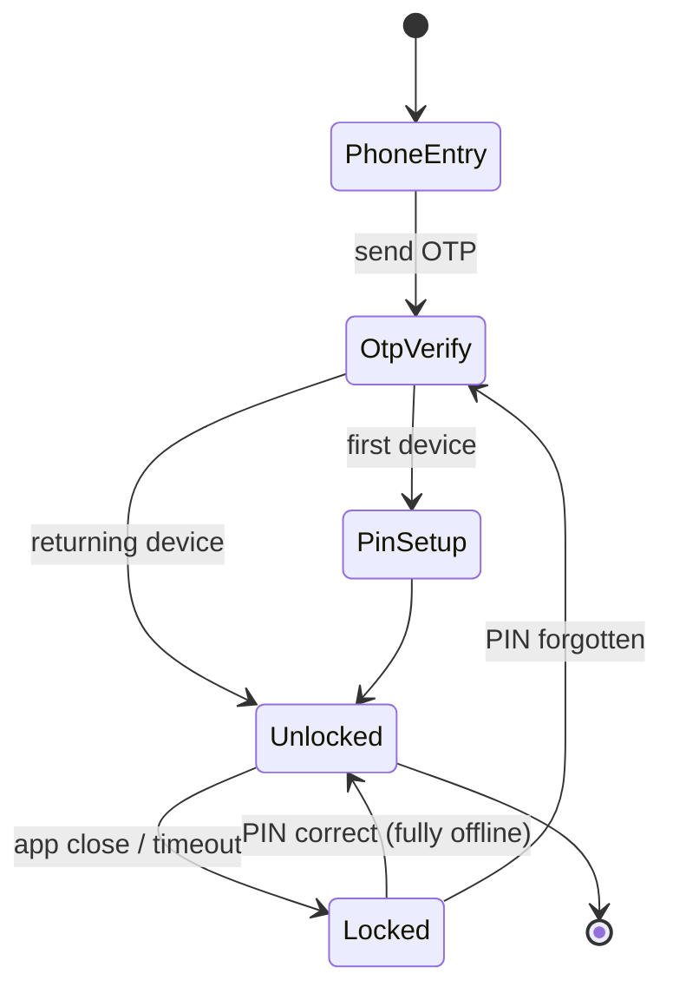

# Design Document

## Overview

This design evolves the existing single-store dairy PWA (`DodlaApp`, v2.0.0 — vanilla TypeScript + Vite + Supabase) into a multi-vendor, offline-first store management platform.

Three structural changes drive the entire design:

1. **Tenancy.** Today no table carries a store identifier and RLS is `USING (true)` for all authenticated users (`supabase-auth-rls.sql:50-53`). Every table gains `store_id`, and RLS becomes membership-derived.
2. **Inversion of the source of truth.** Today the client is a thin view over Supabase, and `BaseService.execute()` hard-rejects every write when `navigator.onLine` is false (`src/lib/base-service.ts:30-34`) — data entered offline is simply lost. The local device becomes the read/write source of truth (IndexedDB), with a sync engine reconciling to Postgres.
3. **Immutable money.** Today revenue and customer balances are recomputed from *current* prices — `getFullDailySummary()` multiplies historical quantities by today's price list (`inventory.service.ts:401-426`), and the `customer_balances` view multiplies historical quantities by `products.wholesale_price` (`supabase-balance-views.sql:14`). A price change silently rewrites history. Prices are captured at transaction time.

The design preserves what works: the event-ledger model for stock, the set-exact entry UX (typing `0` clears a cell), the `ServiceResult<T>` error envelope, and the page/service module structure.

### Goals

- Multi-tenant isolation enforced at the database layer, not the query layer (Req 11.1)
- Full functionality with zero connectivity, including reports (Req 6, Req 9.5)
- Incremental, bandwidth-frugal sync with deterministic conflict resolution (Req 6.3-6.4, Req 11.4)
- Sub-200ms local interactions (Req 11.2)
- Telugu / Hindi / English UI with live switching (Req 10)

### Non-Goals

- Server-rendered or native apps — the PWA remains the single delivery vehicle
- Real-time collaborative editing (sync is periodic and convergent, not live)
- Payment gateway, GST/e-invoicing, or supplier purchase orders
- Cross-store analytics for platform operators (a later admin surface)

### Carried-Forward Capabilities

The requirements document does not mention **advance orders**, but `advance_orders` / `advance_order_items` and the `advances.ts` screen exist and are in active use. They are retained, tenant-scoped, and made offline-capable like everything else. `advance-order.service.ts:154-209` (`markDelivered`) performs up to N+2 sequential non-transactional writes; this design replaces that with a single queued composite operation (§6.3).

---

## Architecture

### System Context



The critical property: **no UI code path awaits the network.** `UI → Repository → IndexedDB` is synchronous-fast and always available. The sync engine is a background process whose failure is a status indicator, never a blocked user action.

### Client Layers

| Layer | Directory | Responsibility | Change from today |
|---|---|---|---|
| Pages | `src/pages/` | Render + event delegation | Read via repositories; re-render on locale/sync events |
| Components | `src/components/` | Header, nav, modal, toast, **store switcher**, **sync badge** | Two new components |
| Repositories | `src/data/repos/` | Typed CRUD over IndexedDB; write-through to outbox | **New** — replaces `src/services/*` Supabase calls |
| Ledger Engine | `src/domain/ledger.ts` | Stock availability, revenue, profit, balances | **New** — port of `stock_summary()` SQL + `getFullDailySummary()` JS into one authoritative module |
| Sync Engine | `src/sync/` | Outbox drain, delta pull, conflict resolution | **New** |
| Local DB | `src/data/db.ts` | IndexedDB schema, migrations, indexes | **New** — replaces `demo-data.ts` localStorage hacks |
| Session | `src/lib/session.ts` | Current user, store, role, locale | **New** — replaces the hardcoded `USERNAME_TO_EMAIL` map (`auth.ts:11-15`) |
| i18n | `src/i18n/` | Catalogs + `t()` + live re-render | **New** |

`src/lib/error-handler.ts` (the `ServiceResult<T>` / `ApiError` envelope) is kept as-is and reused by repositories — its `ErrorCode` union gains `SYNC_CONFLICT` and loses the user-facing meaning of `OFFLINE` (offline is no longer an error).

### Key Design Decisions

| # | Decision | Rationale | Requirements |
|---|---|---|---|
| D1 | **IndexedDB as source of truth**, not a cache | Reports and all writes must work offline with no degradation; a cache-with-fallback model cannot guarantee that | 6.1, 6.2, 9.5 |
| D2 | **Client-generated UUIDv7 primary keys** on all mutable tables | Offline writes need IDs before the server sees them; v7 is time-ordered so it indexes well. Today all PKs except `customers.id` are Postgres identities — a hard blocker | 6.1, 6.3 |
| D3 | **Shared Supabase project, `store_id` + RLS** — not a DB-per-vendor | Thousands of tenants; per-tenant provisioning is operationally untenable. Isolation via RLS + composite indexes leading with `store_id` | 11.1, 11.3 |
| D4 | **Outbox operation log**, not dirty-row diffing | Preserves user intent ordering (e.g. create customer → sale to that customer) and makes composite operations atomic client-side | 6.3 |
| D5 | **Monotonic server sequence for pull cursors**, not timestamps | Timestamp cursors lose rows written inside the same clock tick and break under client clock skew | 6.3, 11.4 |
| D6 | **LWW at cell grain** using `client_updated_at` + `device_id` tiebreak | The existing set-exact UX (`setSoldQuantity` replaces a whole `(product, date, sale_type, customer)` slot) is already a last-writer register — LWW is semantically correct here, not merely convenient | 6.4 |
| D7 | **Prices snapshotted onto transaction rows** (`unit_price`, `line_total`) | Req 2.3 requires historical amounts to survive price edits; the current recompute-from-current-price model violates it in two places | 2.3, 8.4, 9.3 |
| D8 | **Ledger math in TypeScript, authoritative**; SQL views mirror it for server-side reporting | Req 9.5 forbids a network round-trip for reports, so the math must exist client-side. Having it exist in *both* places authoritatively is the real risk — so SQL is designated secondary and pinned by a conformance test (§14) | 9.5, 11.2 |
| D9 | **Phone OTP for identity, PIN as local app lock** | A 4-6 digit PIN as a Supabase password is brute-forceable, and a network-dependent unlock breaks offline launch. OTP proves the number once per device; the PIN gates the persisted local session | 1.1, 6.2 |
| D10 | **Soft deletes** (`deleted_at`) on all synced tables | A hard delete is invisible to a peer device that never saw the row; tombstones are required for convergence | 6.3, 7.2 |
| D11 | **Store templates bundled in the client**, not fetched | Sign-up must complete offline (Req 1.4), so template seeding cannot depend on the server | 1.3, 1.4, 2.4 |

---

## Data Model

### Entity Relationships



### Tenancy and Identity

```sql
-- One row per authenticated human. auth.users holds the phone; this holds app data.
create table profiles (
  id            uuid primary key references auth.users(id) on delete cascade,
  phone         text not null unique,
  display_name  text,
  locale        text not null default 'en',      -- 'en' | 'hi' | 'te'   (Req 10)
  created_at    timestamptz not null default now()
);

create table stores (
  id            uuid primary key,               -- client-generated (D2, Req 1.4)
  name          text not null,
  store_type    text not null default 'general',-- dairy|kirana|vegetable|general (Req 1.3)
  owner_id      uuid not null references profiles(id),
  currency      text not null default 'INR',
  default_locale text not null default 'en',
  low_stock_threshold numeric not null default 3, -- replaces the `<= 3` magic number
  created_at    timestamptz not null default now()
);

create table store_members (                     -- Req 7.3
  store_id  uuid not null references stores(id) on delete cascade,
  user_id   uuid not null references profiles(id) on delete cascade,
  role      text not null check (role in ('owner','assistant')),
  joined_at timestamptz not null default now(),
  primary key (store_id, user_id)
);
create index on store_members (user_id);
```

### Standard Column Set

Every tenant-scoped table carries this block. It is what makes tenancy, sync, and tombstones uniform — and what lets `sync_push` / `sync_pull` be table-generic.

```sql
  id                 uuid primary key,          -- client-generated UUIDv7
  store_id           uuid not null references stores(id) on delete cascade,
  client_updated_at  timestamptz not null,      -- device clock; LWW comparand (D6)
  device_id          uuid not null,             -- LWW tiebreak, and echo suppression
  deleted_at         timestamptz,               -- tombstone (D10)
  server_seq         bigint not null default nextval('sync_seq'), -- pull cursor (D5)
  server_updated_at  timestamptz not null default now()
```

`server_seq` is maintained by a single `BEFORE INSERT OR UPDATE` trigger applied to every synced table:

```sql
create sequence sync_seq as bigint;

create or replace function touch_sync_columns() returns trigger
language plpgsql as $$
begin
  new.server_seq := nextval('sync_seq');
  new.server_updated_at := now();
  return new;
end $$;
```

A global sequence (rather than per-store) is intentional: it is monotonic, gap-tolerant, and a client's cursor only ever advances past rows RLS allowed it to see.

### Catalog

```sql
create table categories (
  <standard columns>,
  name       text not null,
  sort_order int not null default 0
);
create unique index on categories (store_id, lower(name)) where deleted_at is null;

create table products (
  <standard columns>,
  category_id  uuid references categories(id),
  name         text not null,                   -- vendor's own language (Req 10.4)
  unit         text not null default 'pc',      -- pc|kg|g|l|ml|packet  (Req 2.2)
  barcode      text,                            -- Req 3.6
  min_stock    numeric not null default 0,      -- now actually read (was dead in v2)
  active       boolean not null default true,
  -- current prices, denormalized for fast local reads
  purchase_price  numeric,                      -- optional (Req 2.2, 9.3)
  selling_price   numeric not null,             -- retail
  wholesale_price numeric
);
create index on products (store_id, category_id) where deleted_at is null;
create unique index on products (store_id, barcode) where barcode is not null and deleted_at is null;

-- Append-only, time-effective price history. Unlike v2's product_prices (written
-- fire-and-forget and never read back: price.service.ts:114-121), this is the
-- authoritative record for "what did this cost on date X".
create table product_prices (
  <standard columns>,
  product_id      uuid not null references products(id) on delete cascade,
  effective_from  date not null,
  purchase_price  numeric,
  selling_price   numeric not null,
  wholesale_price numeric
);
create unique index on product_prices (store_id, product_id, effective_from) where deleted_at is null;
```

`products.selling_price` stays denormalized because every entry screen reads it on every render; `product_prices` is consulted only for backdated entry and audit. Repository writes update both in one outbox operation, closing the v2 divergence hole.

### Customers and Credit

```sql
create table customers (
  <standard columns>,
  name          text not null,
  phone         text,
  address       text,
  customer_type text not null default 'wholesale', -- wholesale|retail|both
  credit_limit  numeric,                            -- Req 2.5, 8.5
  opening_balance numeric not null default 0
);
create index on customers (store_id) where deleted_at is null;
```

`ledger_entries` generalizes v2's `customer_notes` (which overloaded a `note_type` of `payment|balance|note`) into an explicit money movement log:

```sql
create table ledger_entries (
  <standard columns>,
  customer_id  uuid not null references customers(id) on delete cascade,
  entry_type   text not null check (entry_type in ('credit','payment','opening','adjustment')),
  amount       numeric not null,                 -- always positive; entry_type gives sign
  entry_date   date not null,
  sale_order_id uuid references sale_orders(id) on delete cascade, -- set for 'credit'
  note         text
);
create index on ledger_entries (store_id, customer_id, entry_date desc) where deleted_at is null;
```

Balance is `Σ(credit + opening + adjustment) − Σ(payment)` over **stored amounts**. This is the fix for the v2 flaw where `customer_balances` recomputed purchases from the current wholesale price, so every price edit rewrote every customer's history.

### Sales

v2 has no order entity: a sale is a loose set of `inventory_transactions` rows keyed by `(product, date, sale_type, customer)`. Requirement 8.1 ("mark **the transaction** as credit or paid") needs a header to attach payment status to, and Requirement 4.2 needs a subtotal. So sales get a header — shaped to match the existing per-customer-per-day grid UX exactly.

```sql
create table sale_orders (
  <standard columns>,
  customer_id    uuid references customers(id),  -- NULL for retail (Req 5)
  sale_type      text not null check (sale_type in ('wholesale','retail')),
  sale_date      date not null,
  subtotal       numeric not null default 0,      -- Σ line_total, maintained on write
  payment_status text not null default 'paid' check (payment_status in ('paid','credit')),
  note           text
);
-- One order per customer per day (wholesale) / per day (retail) — the entry-grid grain.
create unique index on sale_orders (store_id, sale_date, sale_type, coalesce(customer_id,'00000000-0000-0000-0000-000000000000'::uuid))
  where deleted_at is null;

create table sale_items (
  <standard columns>,
  sale_order_id uuid not null references sale_orders(id) on delete cascade,
  product_id    uuid not null references products(id),
  quantity      numeric not null check (quantity > 0),
  unit_price    numeric not null,                -- snapshot at entry time (D7, Req 2.3)
  line_total    numeric not null                 -- quantity * unit_price, stored
);
create unique index on sale_items (store_id, sale_order_id, product_id) where deleted_at is null;
```

The `(sale_order_id, product_id)` uniqueness makes each grid cell a single addressable register — exactly the LWW unit from D6. Setting a cell to `0` tombstones the row, preserving v2's clear-by-zero behavior without the destructive non-atomic delete-then-insert of `setSoldQuantity` (`inventory.service.ts:109-173`).

### Stock Movements

Sold quantities live in `sale_items`; everything else that moves stock lives here.

```sql
create table stock_movements (
  <standard columns>,
  product_id    uuid not null references products(id),
  movement_type text not null check (movement_type in ('received','damaged','adjustment')),
  quantity      numeric not null check (quantity > 0),
  unit_cost     numeric,                         -- purchase price snapshot (Req 3.4, 9.3)
  movement_date date not null,
  note          text
);
create unique index on stock_movements (store_id, movement_date, product_id, movement_type)
  where deleted_at is null and movement_type <> 'adjustment';
create index on stock_movements (store_id, movement_date);
```

The partial unique index gives `received` and `damaged` the same one-cell-per-(product, date) register semantics the Stock In screen already assumes, while leaving `adjustment` free-form and append-only.

### Availability Model

```
opening(p, d)   = Σ received(p, < d) − Σ damaged(p, < d) − Σ sold(p, < d)
available(p, d) = opening(p, d) + received(p, d) − damaged(p, d) − sold(p, d)
```

Two deliberate corrections to the v2 `stock_summary()` function:

- **Damages are subtracted.** `supabase-stock-summary.sql:8` documents that damages are ignored; Requirement 3.5 states availability explicitly as `opening + received − sold − damaged`.
- **No `GREATEST(…, 0)` floor.** v2 floors both `opening` and `available` at zero (`:9`), which silently hides oversell and data-entry errors. Negative availability is surfaced as a data-quality warning instead.

Requirement 3.1 ("carry forward the previous day's available as opening") is satisfied by derivation, not by writing an opening row — there is no day-close job to fail, and backdated corrections automatically reflow forward.

### Index Strategy

Every index on a tenant-scoped table leads with `store_id`. With `store_id` as the leading key, a scan for one store never touches another store's heap pages — this is the mechanism behind Requirement 11.1. Hot paths and their supporting indexes:

| Query | Index |
|---|---|
| Day's sales for a store | `sale_orders (store_id, sale_date, sale_type, customer_id)` |
| Cumulative stock for a product | `stock_movements (store_id, product_id, movement_date)` |
| Customer balance | `ledger_entries (store_id, customer_id, entry_date desc)` |
| Sync pull delta | `(store_id, server_seq)` on every synced table |

---

## Components and Interfaces

### Local Database

```ts
// src/data/db.ts
export const DB_NAME = 'store_platform';
export const DB_VERSION = 1;

/** Object stores mirror server tables 1:1, plus sync bookkeeping. */
export type StoreName =
  | 'stores' | 'store_members' | 'categories' | 'products' | 'product_prices'
  | 'customers' | 'sale_orders' | 'sale_items' | 'stock_movements'
  | 'ledger_entries' | 'advance_orders' | 'advance_order_items'
  | 'outbox' | 'sync_state' | 'sync_conflicts';

export interface SyncedRow {
  id: string;
  store_id: string;
  client_updated_at: string;   // ISO 8601
  device_id: string;
  deleted_at: string | null;
  server_seq: number | null;   // null until confirmed by the server
  _dirty: 0 | 1;               // local-only: has unpushed changes
}

export function openDb(): Promise<IDBDatabase>;
export function tx(stores: StoreName[], mode: IDBTransactionMode): IDBTransaction;
```

Each object store is keyed on `id` with indexes mirroring the SQL table (`by_store_date`, `by_store_product`, `by_dirty`, `by_server_seq`). IndexedDB is used directly rather than through a wrapper library to avoid adding a runtime dependency to what is currently a one-dependency project.

### Repository Layer

```ts
// src/data/repos/base.repo.ts
export abstract class BaseRepository<T extends SyncedRow> {
  protected abstract readonly storeName: StoreName;
  protected abstract readonly table: string;      // server table for outbox ops

  /** Local read. Never touches the network. */
  protected async read<R>(fn: (s: IDBObjectStore) => Promise<R>): Promise<ServiceResult<R>>;

  /**
   * Local write + outbox enqueue, in ONE IndexedDB transaction.
   * Atomicity here is what guarantees an accepted write is never lost.
   */
  protected async write(op: WriteOp<T>): Promise<ServiceResult<T>>;
}
```

`BaseRepository` replaces `BaseService` (`src/lib/base-service.ts`). The single most important difference: **there is no `isOnline()` check.** The `failure(new ApiError('Device is offline', 'OFFLINE'))` short-circuit at `base-service.ts:30-34` is deleted, and with it the `'No internet — not saved. Reconnect and try again.'` message (`error-handler.ts:58`).

```ts
// src/data/repos/sales.repo.ts
export interface SetCellParams {
  storeId: string;
  saleDate: string;                         // YYYY-MM-DD
  saleType: 'wholesale' | 'retail';
  customerId: string | null;                // required when saleType === 'wholesale'
  productId: string;
  quantity: number;                         // 0 tombstones the cell
}

export interface SalesRepository {
  /** Idempotent upsert of one grid cell; creates the order header on demand. */
  setCell(p: SetCellParams): Promise<ServiceResult<SaleOrder>>;
  getOrder(storeId: string, date: string, saleType: SaleType, customerId: string | null)
    : Promise<ServiceResult<SaleOrderWithItems | null>>;
  getDayOrders(storeId: string, date: string): Promise<ServiceResult<SaleOrderWithItems[]>>;
  /** Req 8.1 — flips payment_status and adds/removes the matching credit ledger entry. */
  setPaymentStatus(orderId: string, status: 'paid' | 'credit'): Promise<ServiceResult<void>>;
}
```

`setCell` is the direct successor to `inventoryService.setSoldQuantity`, keeping the call shape familiar to `wholesale.ts` and `retail.ts` while replacing two unsafe network round-trips with one local transaction.

### Ledger Engine

```ts
// src/domain/ledger.ts — pure functions, no I/O, the authoritative math (D8)
export interface ProductDayStock {
  productId: string; productName: string; categoryName: string | null;
  opening: number; received: number; damaged: number;
  soldRetail: number; soldWholesale: number; sold: number;
  available: number;                    // may be negative — surfaced, not hidden
  belowMinStock: boolean;               // reads products.min_stock
}

export interface DaySummary {
  date: string;
  revenueRetail: number; revenueWholesale: number; revenueTotal: number;
  purchaseCost: number; damagedLoss: number; profit: number;
  products: ProductDayStock[];
  topCustomers: Array<{ customerId: string; name: string; amount: number }>;
}

export function computeDayStock(input: LedgerInput, date: string): ProductDayStock[];
export function computeDaySummary(input: LedgerInput, date: string): DaySummary;
export function computePeriodSummary(input: LedgerInput, from: string, to: string): PeriodSummary;
export function computeCustomerBalances(input: LedgerInput): CustomerBalance[];
```

Revenue sums **stored** `line_total` values; profit uses `unit_cost` captured on receipt. Neither consults the current price list, so historical reports are stable across price edits (Req 9.3).

**Snapshot cache for Req 11.2.** Cumulative `opening` over an unbounded history cannot stay under 200ms as a store accumulates years of movements. A local `stock_snapshots` object store holds `(store_id, product_id, as_of_date) → net_quantity`, written on the first read of each new day. `opening(p, d)` then reads the newest snapshot `≤ d` and replays only movements after it. Backdated edits invalidate snapshots at or after the edited date.

### Sync Engine

```ts
// src/sync/types.ts
export type OpKind = 'upsert' | 'delete';

export interface OutboxOp {
  seq: number;                  // local autoincrement — preserves intent order (D4)
  op_id: string;                // uuid; idempotency key on the server
  store_id: string;
  table: string;
  kind: OpKind;
  row_id: string;
  payload: Record<string, unknown> | null;
  client_updated_at: string;
  device_id: string;
  attempts: number;
  last_error: string | null;
  /** Ops sharing a group_id are applied in one server transaction (§6.3). */
  group_id: string | null;
}

export interface SyncState {
  store_id: string;
  cursor: number;               // highest server_seq applied locally (D5)
  last_push_at: string | null;
  last_pull_at: string | null;
  last_error: string | null;
}

export interface SyncEngine {
  start(): void;                // wires online/visibility/interval triggers
  stop(): void;
  syncNow(storeId: string): Promise<SyncResult>;
  onStatusChange(cb: (s: SyncStatus) => void): () => void;
}

export type SyncStatus =
  | { phase: 'idle'; pending: number; lastSyncAt: string | null }
  | { phase: 'syncing'; pending: number }
  | { phase: 'offline'; pending: number }
  | { phase: 'error'; pending: number; message: string };
```

### Session and Auth

```ts
// src/lib/session.ts
export interface Session {
  userId: string;
  phone: string;
  storeId: string;              // active store
  role: 'owner' | 'assistant';
  locale: Locale;
  deviceId: string;             // generated once, persisted
}

export function getSession(): Session | null;          // sync; from local cache
export function setActiveStore(storeId: string): Promise<void>;  // clears page caches
export function can(action: Capability): boolean;       // Req 7.4 client-side gate
```

`setActiveStore` must invalidate the module-level caches in the page modules (`products`, `categories`, `customers`, `lastSummary`, `todayCustomers`). v2's `if (x.length === 0)` cache guards have no invalidation hook, so a store switch would render the previous tenant's data; store switching publishes a `store:changed` event that every page module subscribes to in order to clear its caches.

### Store Switcher and Sync Badge

Two new components in `src/components/`. The sync badge renders `SyncStatus` in the header next to the existing date navigator, with pending-op count and a tap-to-sync action. The store switcher appears only when `store_members` yields more than one store for the user.

---

## Sync Engine Design

### Write Path



### Server Contract

```sql
-- Push: apply a batch of client operations. Idempotent on op_id.
create function sync_push(p_store_id uuid, p_device_id uuid, p_ops jsonb)
returns jsonb language plpgsql security invoker as $$
  -- for each op, in array order:
  --   authorize: caller is a member of p_store_id with a role permitting the table
  --   dedupe:    skip if op_id already in sync_applied_ops
  --   resolve:   if existing.client_updated_at > op.client_updated_at  -> server wins
  --              if equal -> higher device_id wins (deterministic tiebreak)
  --              else -> apply upsert/tombstone
  -- returns { applied: [op_id], conflicts: [{op_id, row_id, table, server_row}],
  --           server_seq: bigint, server_time: timestamptz }
$$;

-- Pull: incremental delta, cursor-paged, RLS-filtered. (Req 11.4)
create function sync_pull(p_store_id uuid, p_since bigint, p_limit int default 500)
returns jsonb language sql security invoker as $$
  -- returns { changes: { <table>: [row, ...] }, cursor: bigint, has_more: boolean }
  -- ordered by server_seq; includes tombstones (deleted_at not null)
$$;
```

`security invoker` means both functions run under the caller's RLS — the tenancy guarantee cannot be bypassed by the sync path. This is a deliberate contrast with v2's `stock_summary()`, which takes no tenant parameter and scans everything.

`sync_applied_ops (op_id uuid primary key, applied_at timestamptz)` gives push idempotency, so a response lost to a dropped connection is safe to retry. Rows older than 30 days are pruned; ops are never retried that long.

### Composite Operations

Multi-row user intents share a `group_id` and are applied in one server transaction — fixing three known v2 partial-failure modes:

| Intent | Rows | v2 failure mode |
|---|---|---|
| Deliver advance order | N `sale_items` + `sale_orders` + `ledger_entries` + `advance_orders.status` | `markDelivered` does N+2 sequential writes; partial failure leaves half-delivered state (`advance-order.service.ts:154-209`) |
| Create advance order | `advance_orders` + N `advance_order_items` | Two inserts; a failed item insert orphans the order (`:28-65`) |
| Update price | `products` + `product_prices` | History insert is un-awaited and only warns on failure (`price.service.ts:114-121`) |

### Conflict Resolution

LWW on `client_updated_at`, `device_id` as tiebreak (D6). To keep LWW meaningful under skewed device clocks, `client_updated_at` is generated by a **hybrid clock**: `max(Date.now(), lastServerTime + localElapsedSinceLastSync)`. Every sync response carries `server_time`, which pins the client's logical clock forward. A device whose wall clock is a week behind therefore cannot stamp writes that lose every conflict forever.

When the server wins over a locally-dirty row, the engine writes a `sync_conflicts` record `{ table, row_id, local_value, server_value, resolved_at }`, applies the server value locally, and toasts the vendor with an affordance to inspect what changed (Req 6.4). Conflicts are informational — never blocking.

### First-Device Hydration

A new device authenticates, then pulls from `cursor = 0` in 500-row pages, writing each page in one IndexedDB transaction and persisting the cursor after each (Req 6.5). Progress is shown; interruption resumes from the last persisted cursor rather than restarting.

### Scheduling

Push and pull are attempted on: `online` event, document `visibilitychange` → visible, a 60-second timer while visible, and immediately after a write when already online. Failures back off exponentially (2s → 5m, jittered). The engine holds a single in-flight promise per store so overlapping triggers coalesce.

---

## Offline and PWA

The current service worker (`public/sw.js`, 33 lines) is network-first with no precache and returns early for non-GET requests — meaning a first offline launch works only for URLs already visited, and there is no offline document fallback.

- **Precached app shell** via `vite-plugin-pwa` (Workbox), with `navigateFallback` to `index.html`. This makes cold offline launch deterministic.
- **Self-host icons.** `index.html:16` loads `@phosphor-icons/web` from unpkg — an offline liability on first launch. Icons move into the bundle.
- **No API caching.** Today Supabase GET responses are opportunistically runtime-cached and can be served stale. All data now comes from IndexedDB, so `sync_push`/`sync_pull` are explicitly excluded from the SW cache.
- **Per-vendor manifest.** `manifest.json` is currently hardcoded to "Aarohi Enterprises" with a single 512px icon. It becomes generic ("Store Manager"), gains a 192px icon and `maskable` variant, and takes `start_url` from the deployment base. Per-store display names come from the in-app header, not the manifest.
- **`base` path.** `vite.config.ts:6` hardcodes `base: '/aarohi-store-app/'` for GitHub Pages. This becomes `base: process.env.VITE_BASE_PATH ?? '/'` so the platform can be served from a root domain.

Storage budget: a store with 20 products, 50 customers, and 3 years of daily entries is roughly 250k rows worst case, well inside typical IndexedDB quotas. `navigator.storage.persist()` is requested at onboarding to reduce eviction risk, and `estimate()` drives a warning at 80% quota.

---

## Security

### RLS Policies

Every tenant-scoped table gets a membership predicate. The helper is marked `stable` and `security definer` so the membership lookup is not itself subject to recursion:

```sql
create or replace function is_store_member(p_store uuid) returns boolean
language sql stable security definer set search_path = public as $$
  select exists (
    select 1 from store_members
    where store_id = p_store and user_id = auth.uid()
  );
$$;

create or replace function has_store_role(p_store uuid, p_role text) returns boolean
language sql stable security definer set search_path = public as $$
  select exists (
    select 1 from store_members
    where store_id = p_store and user_id = auth.uid() and role = p_role
  );
$$;
```

Two policy classes, matching Requirement 7.4:

```sql
-- Operational tables: any member may write (owner or assistant)
-- sale_orders, sale_items, stock_movements, ledger_entries,
-- advance_orders, advance_order_items, customers
create policy member_rw on sale_items for all to authenticated
  using (is_store_member(store_id)) with check (is_store_member(store_id));

-- Configuration tables: read for members, write for owner only
-- stores, store_members, categories, products, product_prices
create policy member_read on products for select to authenticated
  using (is_store_member(store_id));
create policy owner_write on products for insert to authenticated
  with check (has_store_role(store_id, 'owner'));
create policy owner_update on products for update to authenticated
  using (has_store_role(store_id, 'owner')) with check (has_store_role(store_id, 'owner'));
```

`anon` is revoked on every table. Note that v2's `supabase-advance-orders.sql:42-54` grants `advance_orders` / `advance_order_items` to **`anon, authenticated`** with `USING (true)` — if run after the lockdown script it silently reopens anonymous access. That script is deleted as part of this work, and a CI check asserts no policy in the repo contains `using (true)`.

`can()` in the session module mirrors these rules client-side for UI affordance only. The client gate is a courtesy; the database is the enforcement point.

### Authentication Flow (D9)



Supabase phone OTP establishes identity and persists a refresh token on the device. The PIN is stored only as a PBKDF2 hash (via WebCrypto, per-device salt, in IndexedDB) and gates access to that persisted session — so unlocking works with no connectivity, and a stolen device without the PIN yields no data. Five wrong PIN attempts require re-verification by OTP.

**Offline sign-up (Req 1.4).** The store is created locally with a client-generated `id`, the vendor works immediately, and `stores` / `profiles` / `store_members` rows flow through the ordinary outbox once connectivity returns. Because the store `id` was client-generated, no record needs rewriting at that point — this is the payoff of D2.

### Secrets

`.github/workflows/deploy.yml:44-45` hardcodes the production Supabase URL and publishable key as workflow fallbacks. The anon key is designed to be public, so this is not a leak — but it does mean a fork deploys against production data. The fallbacks are removed in favor of required repository variables, with staging and production as separate environments.

---

## Internationalization

No i18n exists today: every string is an inline English literal and `'en-IN'` / `'₹'` are hardcoded in four places (`state.ts:29,50`, `header.ts:36`, `history.ts:27`).

```ts
// src/i18n/index.ts
export type Locale = 'en' | 'hi' | 'te';
export function t(key: string, params?: Record<string, string | number>): string;
export function setLocale(l: Locale): Promise<void>;   // persists + re-renders (Req 10.3)
export function onLocaleChange(cb: (l: Locale) => void): () => void;
export function formatCurrency(n: number, l?: Locale): string;
export function formatDate(d: string, l?: Locale): string;
```

- Catalogs are flat JSON per locale (`src/i18n/locales/{en,hi,te}.json`), keyed by dotted path (`nav.stock`, `sales.emptyState`). `en` is the fallback for missing keys; a build step fails on missing keys in `hi`/`te`.
- All three catalogs are bundled, not lazily fetched — a locale switch must work offline.
- `setLocale` updates `<html lang>`, then re-renders the header, bottom nav, and active page. Because pages already render through idempotent `render*()` functions and bind listeners once via `listenersBound` guards, live re-render needs no new machinery (Req 10.3).
- **User data is never translated** (Req 10.4): product names, category names, customer names, and notes pass through verbatim. Only chrome, validation messages, and `ApiError.displayMessage` are keyed.
- Number and date formatting derive from the locale (`te-IN`, `hi-IN`, `en-IN`); the currency symbol comes from `stores.currency`.

Telugu and Hindi labels are longer than English; layout uses flexible widths and a minimum 44px touch target rather than fixed-width buttons.

---

## Performance and Scalability

| Requirement | Mechanism |
|---|---|
| 11.1 — tenant isolation from volume | `store_id` leads every index; RLS predicate is index-backed; no cross-store query exists in the app |
| 11.2 — 200ms local response | All reads from IndexedDB; ledger math is pure TS over in-memory day slices; `stock_snapshots` bound cumulative replay; render paths already use delegated listeners and single-pass `innerHTML` |
| 11.3 — horizontal scale | Stateless PWA on CDN; Supabase/Postgres scales vertically with read replicas for reporting; sync RPCs are short transactions with no cross-tenant locks |
| 11.4 — incremental sync | `server_seq` cursor pulls only changed rows; pushes carry only changed rows; payloads are column-sparse; 500-row pages cap peak memory and bandwidth |

Additional wins available because reads are local: `history.ts:22` currently issues **one RPC per day, sequentially**, for the history list — this becomes a single local pass. `retail.ts` fires three service calls per render (`:96`, `:103`, `:114`); these become one IndexedDB read.

Server-side growth plan: `sale_items` and `stock_movements` are the high-volume tables. Both are date-keyed, so monthly range partitioning on `movement_date` / `sale_date` is the escape hatch when volume demands it, without changing the client contract.

---

## Error Handling

`ServiceResult<T>` and `ApiError` are retained. The `ErrorCode` union changes:

```ts
export type ErrorCode =
  | 'VALIDATION_ERROR'   // local, pre-write — shown inline on the field
  | 'NOT_FOUND'
  | 'PERMISSION_DENIED'  // role gate (Req 7.4)
  | 'CREDIT_LIMIT'       // Req 8.5 — warning, not a hard block
  | 'SYNC_CONFLICT'      // informational, post-resolution
  | 'SYNC_FAILED'        // background; surfaced in the sync badge only
  | 'STORAGE_FULL'       // IndexedDB quota — the one genuinely blocking local error
  | 'AUTH_REQUIRED'
  | 'UNKNOWN_ERROR';
// 'OFFLINE' and 'NETWORK_ERROR' are removed as user-facing write errors.
```

Handling rules by class:

- **Validation** — enforced in the repository before the local write, so an invalid row never enters the outbox. Ported from `inventory.service.ts:430-445`: quantity must be `> 0` (or exactly `0` to clear), wholesale sales require a customer.
- **Credit limit (Req 8.5)** — `CREDIT_LIMIT` is a *warning*: the repository returns a confirmable result and the vendor may proceed. Blocking a sale because a ledger figure is stale would be worse for the vendor than the stale figure.
- **Sync failures** — never surfaced as modal errors. The sync badge shows pending count and last error; ops stay in the outbox and retry with backoff. An op that fails 10 times is moved to a dead-letter store and flagged for manual review rather than retried forever.
- **Storage full** — the only error that can block a write. The vendor is warned at 80% quota and offered purge of synced history older than 12 months (which is safely reconstructible from the server).
- **Permission denied on push** — indicates the client's cached role is stale (e.g. the owner demoted this device). The engine refreshes membership, and if the write is genuinely disallowed it is dead-lettered with a clear explanation rather than silently dropped.

---

## Migration from v2

The live Aarohi store's data must survive. Migration runs as ordered SQL, with the app offline for the duration.

1. **Create** `profiles`, `stores`, `store_members`; insert one store (`name: 'Aarohi Enterprises'`, `store_type: 'dairy'`) and map the three hardcoded operators from `auth.ts:11-15` to `profiles` rows via their existing `auth.users` records, all as `owner`.
2. **Add** the standard column set to existing tables, backfilling `store_id` to the Aarohi store, `client_updated_at` from `created_at`, and a synthetic `device_id`.
3. **Re-key** integer PKs to UUIDs: add `uuid_id`, populate, add `uuid_*` FK columns, backfill by join, then swap constraints. `customers.id` is already a UUID and is preserved unchanged — which matters because `supabase-import.sql` hardcodes ~49 real customer UUIDs.
4. **Split** `inventory_transactions` into the new shape:
   - `transaction_type = 'received' | 'damaged'` → `stock_movements`
   - `transaction_type = 'sold'` → `sale_items`, grouped into synthesized `sale_orders` by `(transaction_date, sale_type, customer_id)` — exactly the grain the v2 unique-slot semantics already enforced
   - `unit_price` backfilled from `product_prices` effective at `transaction_date`, falling back to the current `products` price. **This is lossy** for periods predating price history; the migration emits a report of rows using the fallback, and those orders are flagged `price_estimated` so reports can disclose it.
5. **Convert** `customer_notes` → `ledger_entries` (`payment` → `payment`, `balance` → `opening`, `note` → `adjustment` with `amount = 0`), then derive `credit` entries from wholesale orders that carry an unpaid balance.
6. **Recompute** balances from the new stored amounts and diff against the old `customer_balances` view. Discrepancies are expected wherever prices changed — that *is* the bug being fixed — and each is reviewed with the store owner before cutover.
7. **Drop** `stock_summary()`, `customer_balances`, and the `USING (true)` policies; apply the new RLS.
8. **Delete** dead code: `DodlaApp/js/` (11 files, ~1000 lines, unreferenced by `index.html` since the v2 rewrite), `data/products.json`, `data/products_rows.csv`, the published Google Sheets URL in `js/sheets-sync.js`, `supabase-seed.sql`, `supabase-import.sql`, `supabase-reset-balances.sql`, `supabase-debug-balances.sql`, and `src/lib/demo-data.ts` (its localStorage fixtures are superseded by real local persistence; demo mode becomes a seeded local store, which also closes the `isDemoMode()` authentication bypass at `main.ts:274`).

Two v2 artifacts also need resolution, both currently dead weight: Tailwind is installed and configured but the UI is hand-rolled CSS (`src/styles/app.css`) — either adopt it during the i18n layout work or remove the dependency; and `vite.config.ts` enables production sourcemaps, which should be uploaded rather than served.

---

## Testing Strategy

Tooling: **Vitest** for unit/integration (aligns with the existing Vite setup), **Playwright** for end-to-end, **pgTAP** for database policies. The repo currently has no tests or linter config.

### Ledger Engine — unit

The highest-value target: pure functions, no I/O, and it encodes the money rules.

- Availability across day boundaries, including the Req 3.1 carry-forward and backdated inserts reflowing forward
- Damages reducing availability (the explicit v2 correction) and negative availability surfacing rather than flooring
- Revenue and profit stability across a price change — the regression test for D7: record a sale, change the price, assert the historical day summary is unchanged
- Balance arithmetic with opening balances, partial payments, and adjustments
- Snapshot cache equivalence: `computeDayStock` with and without snapshots must agree for every date in a generated 400-day fixture

### Sync Engine — integration

Run against `fake-indexeddb` with a scripted server double, then against a real local Supabase for the RPC contract.

- Offline burst: 200 writes with no network, then reconnect → all 200 land, ordering preserved
- Idempotency: push, drop the response, re-push → no duplicate rows
- LWW determinism: same row edited on two devices, both orderings of arrival → identical converged state
- Hybrid clock: a device with a clock 7 days behind still wins conflicts for writes made after its first sync
- Tombstones: delete on device A propagates to device B (Req 7.2)
- Cursor resume: hydration interrupted mid-page resumes without duplication or loss (Req 6.5)
- Composite atomicity: advance-order delivery failing at item 3 of 5 leaves no partial state

### Database — pgTAP

- A member of store A can read/write no row of store B, for every table
- An `assistant` can write operational tables and cannot write configuration tables (Req 7.4)
- `anon` can read nothing
- `sync_push` / `sync_pull` respect RLS when invoked by a non-member
- **Conformance test for D8**: seed a fixture, run the SQL reporting views and the TS ledger over the same data, assert equality. This is the guard against the dual-implementation drift that D8 knowingly accepts.

### End-to-End — Playwright

- Onboarding fully offline: sign up, pick the kirana template, enter a day's sales, reconnect, verify server state (Req 1.4)
- Two browser contexts as two devices: edit the same cell offline on both, reconnect both, assert convergence and that a conflict toast appeared (Req 6.4)
- Locale switch mid-session re-renders chrome and leaves product/customer names untouched (Req 10.3, 10.4)
- Cold offline launch after install renders the shell and last-synced data (the current SW cannot do this)

### Performance

- Automated budget: with a 3-year / 20-product / 50-customer fixture, day-summary render and navigation stay under 200ms on a mid-range Android profile (4x CPU throttle) (Req 11.2)
- Sync payload assertion: a one-cell edit produces a push body under 1KB (Req 11.4)

---

## Requirements Traceability

| Requirement | Design coverage |
|---|---|
| 1 — Vendor onboarding | Auth flow (D9, §Security); `stores`/`profiles`/`store_members`; bundled templates (D11); offline sign-up via client-generated store id (D2) |
| 2 — Store configuration | Catalog tables; `product_prices` time-effective history; `unit_price` snapshots (D7); `customers.credit_limit`; owner-only RLS on config tables |
| 3 — Daily inventory | `stock_movements`; availability model (damages included, no zero floor); derived carry-forward; `products.barcode` |
| 4 — Wholesale customers | `sale_orders` one-per-customer-per-day + `sale_items`; `SalesRepository.setCell`; stored `subtotal` |
| 5 — Retail sales | `sale_orders` with `sale_type='retail'`, `customer_id IS NULL`; separate retail/wholesale revenue in `DaySummary`, combined for stock deduction |
| 6 — Offline-first | IndexedDB as source of truth (D1); outbox (D4); `sync_push`/`sync_pull`; LWW + conflict surfacing (D6); cursor-paged hydration |
| 7 — Multi-device | `store_members` roles; two RLS policy classes; tombstones (D10); store switcher with cache invalidation |
| 8 — Credit ledger | `sale_orders.payment_status`; `ledger_entries` over stored amounts; `CREDIT_LIMIT` warning semantics |
| 9 — Reports | Ledger engine `computeDaySummary` / `computePeriodSummary` / `computeCustomerBalances`, all local (D8) |
| 10 — Multi-language | i18n module; bundled `en`/`hi`/`te` catalogs; live re-render; user data passthrough |
| 11 — Scale & performance | `store_id`-leading indexes; local reads + `stock_snapshots`; stateless CDN client; `server_seq` delta sync |
